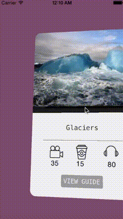

# RGCardViewLayout

[Watch it in action here](https://www.youtube.com/watch?v=g_NGIphyckQ&feature=youtu.be)
This is a layout that clones the interaction of going through cities in the City Guide App. (this app is #3 for the top iOS app animations on the raywenderlich

To use this simply drop it in as a class in the storyboard or nib when you create your collection view. or you can 
instantiate it in code and give it your collection view(via initWithFrame:collectionViewLayout: or just set the layout propery
of the collection View. and you can use your collection View as you always do.

One important this for this layout is that in the datasource protcol to specify the number of cards you must use 
numberOfSectionsInCollectionView: , and for collectionView:numberOfItemsInSection: you must always return 1.

also note that the itemsize is computed by the layout to be "appropriate" to the size of the collection view 
itself so setting it won't do anything.
